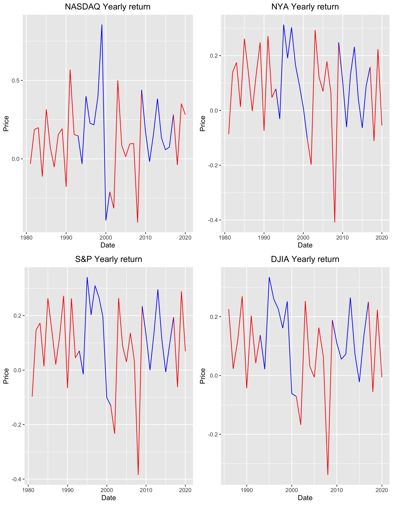

```{r echo=F, eval=T}
library(knitr)
```

### HPC, HTC and Cloud

HPC, HTC, and Cloud Computing are modern answers to "too much data".  

<!--more-->

HPC, HTC, and Cloud Computing are modern answers to "too much data".  As given by the facts listed [here](<https://techjury.net/blog/how-much-data-is-created-every-day/#gref>):

+ 1.7MB of data is created every second by every person during 2020.
+ In the last two years alone, the astonishing 90% of the world’s data has been created.
+ 2.5 quintillion bytes of data are produced by humans every day.
+ 463 exabytes of data will be generated each day by humans as of 2025.
+ 95 million photos and videos are shared every day on Instagram.
+ By the end of 2020, 44 zettabytes will make up the entire digital universe.
+ Every day, 306.4 billion emails are sent, and 5 million Tweets are made.

It is pretty easy to immerse oneself in data and quickly run out of the necessary horsepower to complete a project in a timely manner.  Today, we scale our compute.

----

### What were you doing during the debates?? 

{width=100%}

----

Returns averaged by party and corrected for plans for tax rate:

|party | NASDAQ|  NYA|   SP| DJIA|
|:-----|:------|:----|:----|:----|
|Dem   |   0.20| 0.12| 0.14| 0.14|
|Rep   |   0.09| 0.06| 0.07| 0.06|


|Party | NASDAQ-corr| NYA-corr| SP-corr| DJIA-corr|
|:-----|:-----------|:--------|:-------|:---------|
|Dem   |        0.17|     0.10|    0.12|      0.12|
|Rep   |        0.06|     0.04|    0.04|      0.04|

----

### HPC

HPC, high performance computing, is generally characterized by low latency, high bandwith connections between many identical nodes organized as a single cluster.  HTC, replace the low latency connection with standard ethernet and Cloud abstracts the hardware away with virtual machines and removes the generalization of nodes being identical.  Here we will talk through high performance computing as it is configured and practiced at Virginia Tech.

Computing in shared cluster environments requires both new terminology and a new way to think about computing.  Just pressing GO on a GUI can land you in some trouble.  

----

### What does a cluster look like?

{width=100%}

There are a couple of items to note.

+ login nodes
+ compute nodes
+ storage

----

{width=100%}
Above is old news!!
TinkerCliffs:
1 AMD node = 2 sockets => 64 cores/socket => 128 cores/node
308 nodes => 40448 (+ 1536 cores -- 96 cores/node on 16 Intel nodes)

----

This leads us to a number of terms:

+ system -- all compute and administrative nodes in cluster
+ rack -- one of the standing racks housing the cluster
+ chassis -- collection of nodes in operational unit
+ node -- one "computer" within the cluster
+ socket -- one of two-four locations housing a processors within a node
+ core -- computational subunit within a processor
+ CPU -- just like on your laptop, just bigger
+ GPU -- specialized device, similar to the display GPU on your laptop, just MUCH bigger
+ RAM -- system memory, generally faster and more than on your laptop (128 GB - 3 TB)

----

### GUT check

Can everyone log in to <https://ood.arc.vt.edu> Remember, VPN must be on!

### Break while answering the above ...