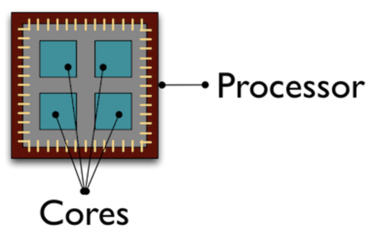
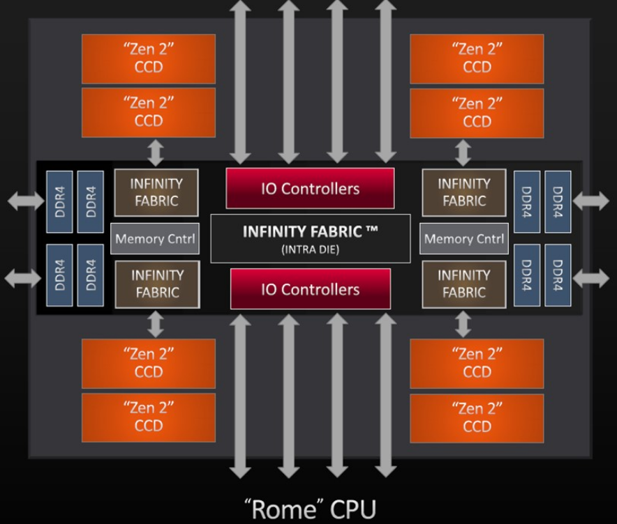
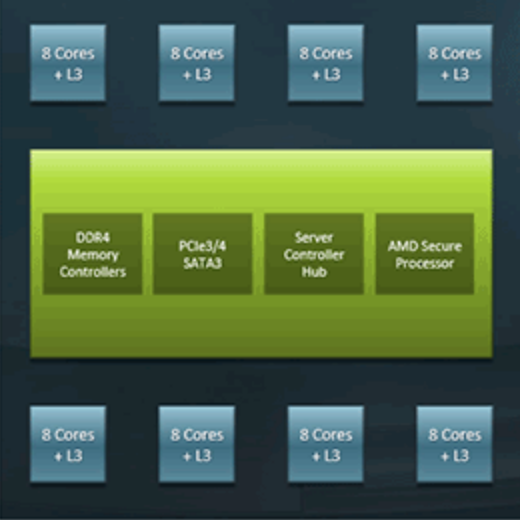

```{r, eval=TRUE, echo=FALSE, include=FALSE}
library(ggplot2)
library(dplyr)
```

Ok, the point to today's discussion.  Your *project* has exceeded what you can do locally.  Possible reasons why:

<!--more-->

### Reasons why your compute can be taking too long 

Ok, the point to today's discussion.  Your *project* has exceeded what you can do locally.  Possible reasons why:

1. memory limits
2. storage limits
3. compute time is too long

For most workstations, 16-48 GB of RAM and a few TB's of local disk is about the practical limit.  Most HPC clusters have nodes with much more RAM and networked parallel storage.  For instance, on ARC machines, most nodes have 128-256 GB of RAM with a few having 3 TB.  For storage, many HPC clusters have fast parallel storage.  Within ARC, we have 7.5 PB on a parallel file system called BeeGFS.

----

### Compute time is too long

The last local compute issue, compute time is too long, is a more complicated discussion.  We are going to focus on the last issue and talk about how you can scale your compute on an HPC cluster.  Before you start, you should know what the cause of the slowness is.  Is the process:

+ i/o bound
+ memory bound
+ CPU bound

Generally, this is a pretty advanced topic and involves performance tools etc to profile the application's behavior.  We are going to skip all that and think about the compute as a pipeline and classify it based on inputs/outputs and steps/calculations.  

----

### Look at local benchmarking

```{r, eval=TRUE, echo=TRUE, include=TRUE}
comp_stats <- read.delim("../img/user_data.tbl",sep=",")
comp_stats$size <- as.numeric(comp_stats$size)
comp_stats <- comp_stats[comp_stats$size>0,]
ggplot(comp_stats,aes(x=as.factor(user),y=as.numeric(actual_solve))) +
  geom_violin() + facet_wrap(~size,scales="free")
```

```{r, eval=TRUE, echo=FALSE, include=TRUE}
comp_stats %>% 
  filter(user=="RS") %>%
  ggplot(aes(x=as.factor(as.numeric(setthreads)),y=as.numeric(actual_solve))) +
    geom_violin() + 
    facet_wrap(~size,scales="free")
```

----

### Reasons for long compute

Here are some possible data flow/computing pipelines (plus some examples):

1. single data set, must all be computed on at one time, involves matrix operations 
    + simple linear regression
2. single data set, must all be computed on at one time, involves loops 
    + bootstrapping
    + nonlinear regression using gradient descent
    + Monte Carlo methods
3. single data set, must all be computed on at one time, involves many hyper parameters that must be optimized 
    + Monte Carlo methods
    + gradient descent
    + machine learning algorithms
4. single data set, can be processed in batches, must be aggregated at end 
    + ML
    + batched gradient descent
5. multiple data sets, identical processing on each 
    + independent models using linear regression

And really any combination of the above.  We will start first by talking through (3) and (5) together.

----

### Pleasingly parallel applications

Pleasingly parallel processing is exemplified by tasks that can be performed completely independently of each other.

  - Suppose for instance, you have a slew of data sets, all independent, and want to create models for each.  You could, given a lab with several workstations, start computing a model on each workstation independent of the others.  On an HPC system, you would submit each data set + desired compute as a script to a scheduler.  In our case Slurm.  As compute nodes are available, the various data plus scripted model will be computed and results returned.


  - In a separate case, suppose you have a data set and have some sort of non-tunable parameter you want to test to create a model, for instance, perhaps a transformation of the response.  Similar to the last, you could submit the data plus appropriate script for each desired transformation to Slurm.  Slurm will, as before, assign compute resources as they are available and return results when those are available.

As it turns out, the matrix mult code I sent you can be thought of this way.  We were creating a data set of varying size and varying threads, repeated a few times, and timing both a crossprod and solve.  With a slight refactor of the code, we could start a bunch of independent jobs and test the various parameters of interest.

Consider the code in solve_time.R.  What if we were to run it like:

```{bash eval=FALSE, echo=TRUE}
for i in {7..13}; do echo Rscript solve_time.R $i; done
```

----

### Now, scale out

To span multiple nodes, use the scheduler!

```{bash eval=FALSE, echo=TRUE}

# run 50 replicates using 64 cores, matrix size = (2^13)^2
for i in {50}; do sbatch -c64 --export=NCOLS=13 SLRUM_solve_time.sh ; done

# what if we want to vary the parameters in a grid search
for cores in {4,8,12,16,32,64,128}; do 
    for ncols in {7..14}; do 
        for reps in {1..7}; do 
            sbatch -c$cores --export=NCOLS=$ncols SLRUM_solve_time.sh;
        done;
    done;
done

```

----

### Linux version of the matrix ops

```{r, eval=TRUE, echo=TRUE, include=TRUE}
linux_side <- readRDS("../img/linux-128.RDS")
linux_side$size <- as.numeric(linux_side$size)
linux_side <- linux_side[linux_side$size>0,]
linux_side %>%
  ggplot(aes(x=as.factor(as.numeric(setthreads)),y=as.numeric(actual_solve))) +
    geom_violin() + 
    facet_wrap(~size,scales="free") +
    theme(axis.text.x = element_text(angle = 90, vjust = 0.5, hjust=1))
```

### More opportunities for parallelization

We have been exploring MKL/OpenBLAS and OpenMP in the code so far.  Within a node, MKL/OpenBLAS accelerate matrix math routines such as matrix multiplication, inverting, transposing, etc.  The algorithms are way beyond what we need to know here.  Where we will end is that many of these algorithms use threading to divide and conquer.  The threading is often controlled by OpenMP.  This is where we jump in.

----

### OpenMP

OpenMP is basically a fork and join model of task launching within an application for shared memory systems (more on that below).  What we did in the pleasingly parallel section can be thought of as a disjointed version of OpenMP.  We started with a set of data and a script, we launched a bunch of tasks that completed independently, and now we would aggregate the results.

OpenMP does this within an application using threading.  A typical use of OpenMP is parallelizing for loops.  Think linear algebra!  Unfortunately for us, OpenMP is for COMPILED languages.  Are we out of luck?  NO, but we have to use Rcpp or the like to use it, ie unless we have a package that wrote it in C/C++/Fortran or we do something in Rcpp, we won't see it outside of the linear algebra routines.

----

### OpenMP example

```{c, eval=FALSE, echo=TRUE, include=TRUE}
## openMPCode example from Rcpp/examples/OpenMP/ by Dirk E.
openMPCode <- '
   // assign to C++ vector
   std::vector<double> x = Rcpp::as<std::vector< double > >(xs);
   size_t n = x.size();
#pragma omp parallel for shared(x, n)
   for (size_t i=0; i<n; i++) {
       x[i] = ::log(x[i]);
   }
   return Rcpp::wrap(x);
'
```

### Step back and look at our processor

In today's world, we are getting speedups by having multiple "mini" processors, called cores, bundled together as a single processor.

TinkerCliffs:
+ 1 node has 2 processors
+ 1 processor has 64 cores


### TinkerCliffs

A single AMD ROME processor has 8 CCD's, each with 8 cores bundled together to create the full processor.





----

### Machine differences

OK, what is the point to all this??

1. Node make, model, proc choice matters  
2. Some knowledge of what your script is doing can point to a solution  


```{r eval=TRUE, echo=FALSE, include=TRUE}
tc_solve <- readRDS("../img/summary.RDS")
tc_solve$machine <- ifelse(grepl("ca",tc_solve$host),"cascades","dragonstooth")
tc_solve$machine <- ifelse(grepl("tc",tc_solve$host),"tinkercliffs",tc_solve$machine)
tc_solve$machine <- ifelse(grepl("intel",tc_solve$host),"tinkercliffs-intel",tc_solve$machine)

tc_solve %>%
  ggplot(aes(x=as.factor(as.numeric(cores)),y=as.numeric(actual))) +
    geom_violin() + 
    facet_wrap(~machine) +
    theme(axis.text.x = element_text(angle = 90, vjust = 0.5, hjust=1))
```

----

### Pleasingly parallel vs coupled

Above, we were giving examples of a single data, ie simulated matrix elements, but varying a hyperparameter to show differences in computing speeds.  What if we are coupled?

Couple systems means not independent.  Examples:

+ iterative updates  
+ Monte Carlo random walks 

In these cases, there may be opportunities for partial parallelization of the algorithm, but perhaps not the whole thing.  Often, this means we are stuck to a single node.  What can we do within a single node?


```{r eval=FALSE, echo=TRUE, include=TRUE}
# summary statistics of sample
n    <- 30
ybar <- 15
s2   <- 3

# sample from the joint posterior (mu, tau | data)
mu     <- rep(NA, 11000)
tau    <- rep(NA, 11000)
T      <- 1000    # burnin
tau[1] <- 1  # initialisation
for(i in 2:11000) {   
    mu[i]  <- rnorm(n = 1, mean = ybar, sd = sqrt(1 / (n * tau[i - 1])))    
    tau[i] <- rgamma(n = 1, shape = n / 2, scale = 2 / ((n - 1) * s2 + n * (mu[i] - ybar)^2))
}
mu  <- mu[-(1:T)]   # remove burnin
tau <- tau[-(1:T)] # remove burnin
hist(mu)

```

----

### Other opportunities for parallization

+ parallel/foreach package
+ Rmpi
+ pbdr*

Within a node, if there are loops or other independent tasks, you can use the parallel or foreach packages to start "workers".  These workers can then perform a task.  Generally, the task is similar, but they do not have to be.

If you must span nodes, but the process is not completely decoupled, you need to think about memory and data location.  Rmpi allows passing of messages back and forth (using MPI) between workers on different nodes (more precisely, in non-shared memory spaces) to allow updating of status.

Finally, the pbdr* suite of packages, allows a combination of the above and includes matrix libraries that can span nodes.


