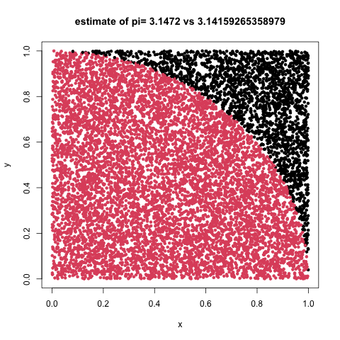
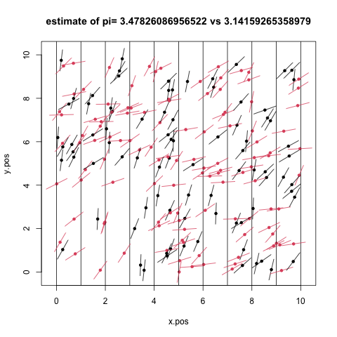
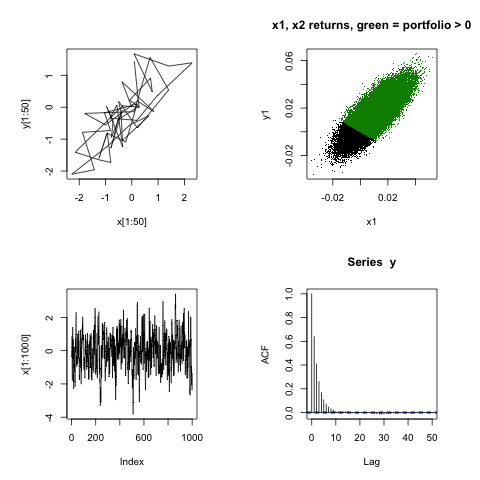

Note, this is a BIG and important topic.  I am barely scratching the surface to show that HPC is an important component due to the computational power required to run some of these models.  Monte Carlo methods are ones that involve repeated random sampling to estimate unknown parameters. 

<!--more-->

### Integration

Numerical integration is also a big and important topic.  We are going to rewind in history a bit and think about Reimann sums.  The basic idea is if you slice the integral region up (see below from Wikipedia) and evaluate the function you are desiring to integrate at the end points of smaller and smaller slices, you can add up the areas under the curve to get the total integral result.  The smaller the slices, the closer to truth the approximation.

```{r out.height="10%",echo=F,include=T}
knitr::include_graphics("https://upload.wikimedia.org/wikipedia/commons/thumb/d/d1/Integration_num_trapezes_notation.svg/1382px-Integration_num_trapezes_notation.svg.png")
```

As an example, suppose we would like to find the area of the unit circle:

```{r out.height="10%",echo=F,include=T}
knitr::include_graphics("https://www.purplemath.com/modules/trig/unitci04.gif")
```


\begin{equation}
x^2 + y^2 \le 1
\end{equation}

If we focus on the first quadrant, we can write this in terms of a simple integral:

\begin{equation}
I = \int_{0}^1 \sqrt{1-x^2} dx
\end{equation}

Which we know evaluates to $\frac{\pi}{4}$ as it is $\frac{1}{4}$ of the unit circle.

Following through with the Reimann sums idea, instead of going through the change of variable etc necessary to analytically determine the result, we could instead, change this to a sum of many many small intervals where we calculate the area of rectangles, or trapezoids etc to find the area under the curve, muliplying by 4, we would arrive at our estimate of pi.

```{r, eval=TRUE, echo=TRUE, include=TRUE}
slices <- 1000
rights <- seq(from=0,to=1,length.out = slices)
widths <- rights[2]
reimanns_pi_right <- sum(sqrt(1-rights[-1]^2))*widths*4
reimanns_pi_left <- sum(sqrt(1-rights[-slices]^2))*widths*4
reimanns_pi <- mean(reimanns_pi_right,reimanns_pi_left)
reimanns_pi
```

### Monte Carlo Integration

Monte Carlo integration is a numerical technique based on distributions and random numbers.  Unlike Riemann Sums, Monte Carlo integration chooses points randomly within the bound of interest according to some known probability distribution.  The function is evaluated at the chosen points, we sum the results and divide by the number of points chosen.  How do we choose the probability distribution to use?  We look at the function to be evaluated, the bounds of the integral, etc for the presence of the kernel to a probability distribution we know.  Essentially, we are looking to find something that looks like this:

\begin{equation}
I = \int_{a}^b g(x)f(x) dx
\end{equation}

where g(x) is an arbitrary function, f(x) is a probability distribution such as:

\begin{equation}
I = \int_{0}^{\infty} x^2 \lambda e^{-\lambda x} dx
\end{equation}

where we recognize $g(x)=x^2$ and f(x) is the pdf of the exponential.

Returning to our unit circle, we can rewrite it as:

\begin{equation}
I = \int_{0}^1 \sqrt{1-x^2} (1) dx
\end{equation}

So, we are evaluating the constant 1 with bounds [0,1], perhaps we can choose $x\sim unif(0,1)$.  So, if we choose the x's accordingly, we can use the following to approximate the interval:

\begin{equation}
I \approx \frac{1}{N}\sum_{x\sim unif(0,1)} \sqrt{1-x^2}
\end{equation}

----

What if we are interested in a function that is not easily written as an integral, but we know how to relate it to something we do know.

As an example, consider the function and integral:

\begin{equation}
H(x,y) = \begin{cases} 1\text{ if } x^2+y^2 \le 1, \\
                0\text{ otherwise} \\
           \end{cases}
\end{equation}

\begin{equation}
I = \int_{x,y \in [-1,1]} H(x,y)dx dy
\end{equation}

which we know as the area of the circle which integrates to pi.  We could evaluate that integral by:

\begin{equation}
\pi = 4*\frac{1}{N}\sum_{x_i,y_i \sim unif[0,1]}^N H(x_i,y_i)
\end{equation}
.

----

### Estimate $\pi$ using darts

We can visualize the repeated random sampling from uniform distributions to estimate pi as a dart game.  Consider playing darts where we have inscribed a circle within the area given by a dart board wall.  If the circle and square are centered at c(0,0) where the circle has radius r=1 while the square has sides of length d=2*r, we can calculate the probablity of hitting the circle vs the square as the ratio of areas given by:

\begin{eqnarray}
\frac{C}{S} &=& \frac{\pi \ast r^2}{(2 \ast r)^2} \\
    &=& \frac{\pi}{4}
\end{eqnarray}

For starters, we will do this using loops and not worry about optimizing via apply functions, memory management or other tricks.

```{r eval=FALSE, echo=TRUE, include=TRUE}
options(digits=15)
#cat("pi=",pi,"\n",sep="")
set.seed(123456)
samples <- 10000
point_container <- matrix(0,nrow=samples, ncol=3)
i <- 0
while(i<samples){
  i <- i+1
  current_point <- runif(n=2,min=0,max=1) #staying in first quad
  dist_from_origin <- sqrt(sum(current_point^2))
  point_container[i,] <- c(current_point,ifelse(dist_from_origin>1,0,1))
}
our_pi <- 4*sum(point_container[,3])/samples
png("./img/darts.png")
plot(point_container[,1],point_container[,2],
     col=point_container[,3]+1,pch=20,
     main=paste("estimate of pi=",our_pi, "vs",pi),
     xlab="x",ylab="y")
dev.off()
```



----

### What about tossing beer cans

Yep, given enough beer, we can estimate pi by throwing empties...

The basic idea is that if you lay out a set of lines separated by the length of the beer can (zero width) and toss beer cans onto the grid, then simply count the beer cans that cross the lines, pi is given by:

\begin{equation}
\pi = \frac{2 \ast n}{k}
\end{equation}
where n = number of empties and k = cans crossing lines.

```{r, eval=FALSE, echo=TRUE, include=TRUE}

n <- 200  ## ok, no comments, but my wife likes IPAs ...
# choose positions of center of needle . Note the " board " is 10X10 , vertical lines x. pos <- runif (n ,0 ,10)
x.pos <- runif(n,0,10)
y.pos <- runif(n,0,10)
rotation <- runif(n,0,pi/2)
# figure out the x,y coords of the match endpoints
x.max <- x.pos + 0.5* cos(rotation)
x.min <- x.pos - 0.5* cos(rotation)
y.max <- y.pos + 0.5* sin(rotation)
y.min <- y.pos - 0.5* sin(rotation)
crosses <- ifelse(ceiling(x.min)==floor(x.max),1,0)
# draw the board

pi_est <- 2*n/sum(crosses)
png("../img/beers.png")
plot(x=x.pos,y=y.pos,xlim=c(-0.2,10.2),ylim=c(-0.2,10.2),
     main=paste("estimate of pi=",pi_est, "vs",pi),pch=20,col=crosses+1)
# draw the lines
abline(v=seq(0,10,1))
# draw the empties
segments(x.min,y.min,x.max,y.max,col = crosses+1)
dev.off()

```



Check out <http://www.clayford.net/statistics/buffons-needle-problem-or-how-to-use-probability-to-estimate-pi/> for the math and discussion.

----

### Gibbs sampling

```{r, eval=FALSE, include=TRUE, echo=TRUE}
http://www.stat.cmu.edu/~brian/463-663/week10/Chapter%2004.pdf
http://rstudio-pubs-static.s3.amazonaws.com/279858_010f9da7c8d744988019397e3fe51cb2.html
http://www2.stat.duke.edu/~rcs46/modern_bayes17/lecturesModernBayes17/lecture-7/07-gibbs.pdf
https://jwmi.github.io/BMS/chapter6-gibbs-sampling.pdf
```

Gibbs sampling follows from the above.  Suppose p(x,y) is some hard to sample from distribution.  However, we can easily sample from the conditional distributions p(x|y) and p(y|x), Gibbs gives us a way to get p(x,y) samples.  The algorithm looks like:

1. set initial values for x and y
2. sample x|y and y|x
3. repeat

As an example, consider a bivariate correlated model for a two-stock portfolio.  We want to model the return given by $W = aX + bY$ where a and b are weights of the included stocks with the daily returns given by X and Y.  The conditional distributions are given by:

\begin{eqnarray}
X & \sim & Norm(\rho Y,\sigma) \\
Y & \sim & Norm(\rho X, \sigma) \text{ where} \\
\sigma & = & \sqrt{1-\rho^2}
\end{eqnarray}

We are also going to model $X_1 \sim Norm(\alpha_1,\beta_1^2)$ as a linear transformation using $X_1 = \alpha_1 X + \beta_1$.

----

Code from Gui Larangeira, California State University, East Bay (link above)
```{r echo=TRUE, eval=FALSE, include=TRUE}
set.seed(1212)
m = 100000; x = y = numeric(m); x[1] = y[1] = 0  # initial conditions
rho = 0.8; sgm = sqrt(1 - rho^2)                 # correlation and standard deviation

for (i in 2:m) {                                 # Gibbs Sampler Loop
  x[i] = rnorm(1, rho*y[i-1], sgm)
  y[i] = rnorm(1, rho*x[i], sgm)
}

alpha.1 = beta.1 = .01
alpha.2 = .015; beta.2 = .012
x1 = alpha.1 +beta.1*x          # x1 ~ N(alpha.1, beta.1)
y1 = alpha.2 +beta.2*y          # x2 ~ N(alpha.2, beta.2)

a= .4; b= .6                    # Portfolio weights
w = a*x1 + b*y1

png("./img/gibbs.png")
par(mfrow=c(2,2), pty="s") # 2 x 2 array of square plots
plot(x[1:50], y[1:50], type="l")
plot(x1, y1, pch=".", main = "x1, x2 returns, green = portfolio > 0");points(x1[w>0], y1[w>0], pch=".", col="green4")
plot(x[1:1000], type="l"); acf(y)
dev.off()
```


The point to the above is not that you can do this simple model, but to show that MCMC can do useful things and the models can become arbitrarily complex and cumbersome to simulate ... HPC.