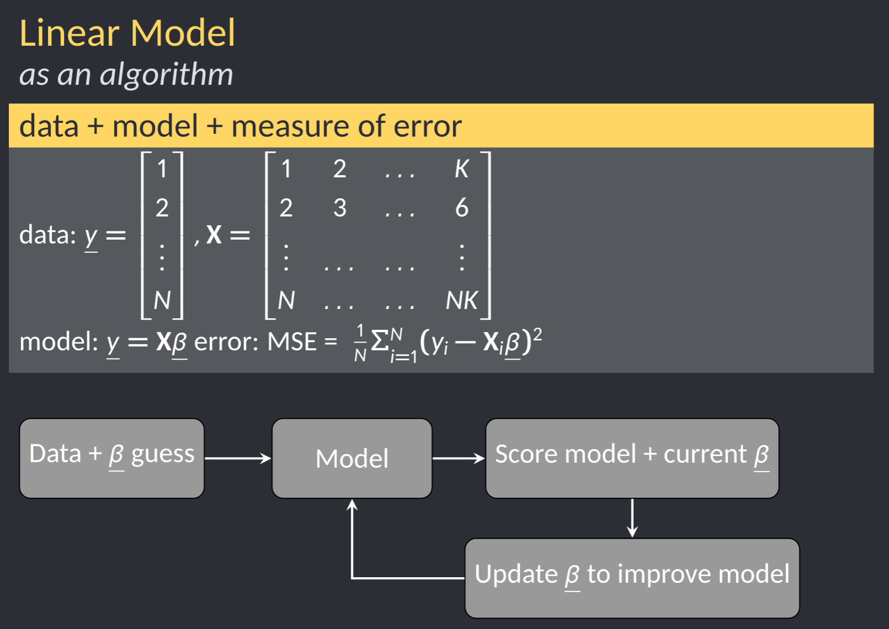
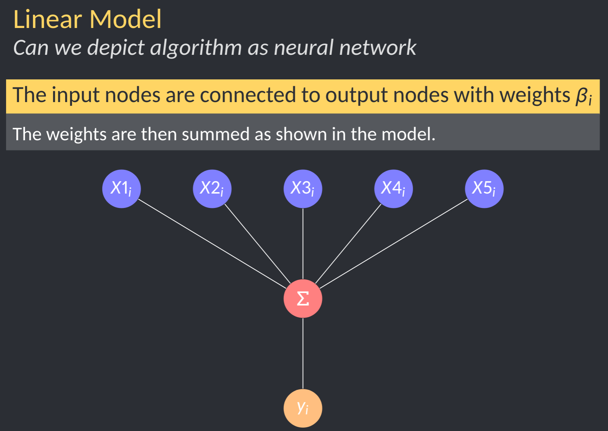
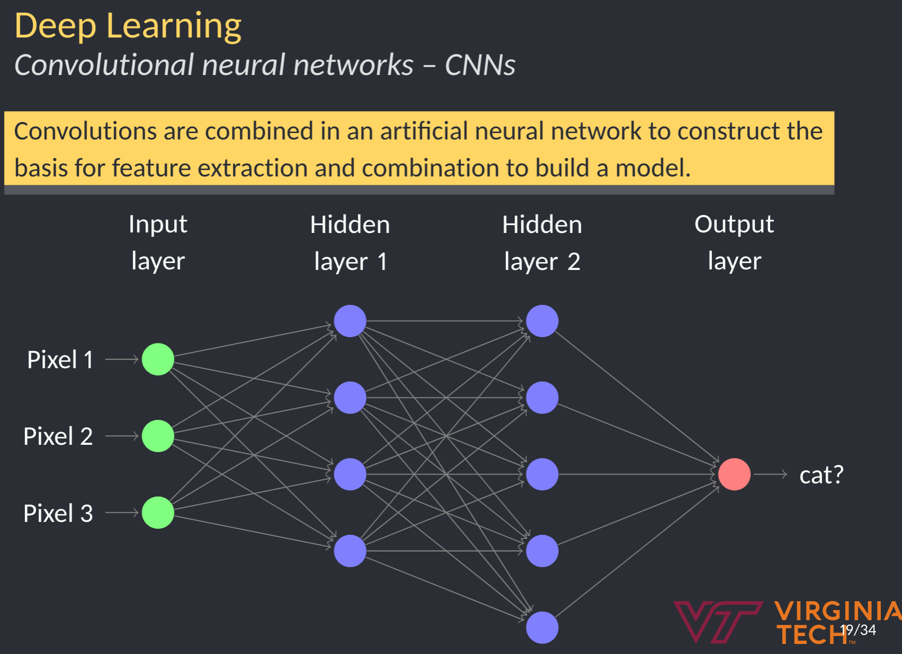

Neural networks are really a framework for building models.  In recent years, these have gained major traction due in part to the popularity of machine learning.  

<!--more-->

Neural networks are really a framework for building models.  In recent years, these have gained major traction due in part to the popularity of machine learning.  However, at the end of the day, these are modeling frameworks.

## Neural networks for linear regression

Neural networks can be used to setup linear regression problems.  The one caveat is that the solution will be iterative, is gradient descent or some other optimization method.  

----

----

### Model blending

----

### NN for image classification

One of the marquee acheivements of neural networks has been in image classification.  Prior to approximately 2012, image classification tasks peaked at about 80% accuracy.  In 2012, AlexNet won the image classification Kaggle Competition using neural networks.

One of the key advanced introduced was convolutions.  Convolutions are essentially matrix operations on the input image.

----

----

----

### Neural network output

- binary
- classification

