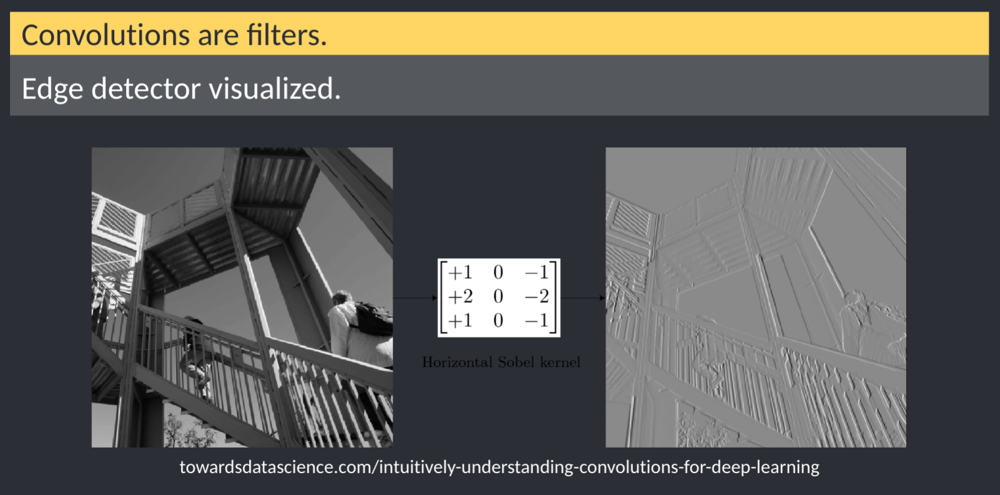

Neural networks are really a framework for building models.  In recent years, these have gained major traction due in part to the popularity of machine learning.  

<!--more-->

Neural networks are really a framework for building models.  In recent years, these have gained major traction due in part to the popularity of machine learning.  However, at the end of the day, these are modeling frameworks.

Neural networks are biologically inspired.  They originally sought to model how a nerve cell receives input and translates that into an output.  Wikipedia has a pretty good discussion.  <https://en.wikipedia.org/wiki/Perceptron>

\begin{equation}
f(x) = \begin{cases} 1\text{ if } \mathbf{wx} \le 0, \\
                0\text{ otherwise} \\
           \end{cases}
\end{equation}


```{r out.height="10%",echo=F,include=T}
knitr::include_graphics("https://www.researchgate.net/profile/Erguen_Akguen/publication/326417061/figure/fig2/AS:648990437679105@1531742786278/Similarity-between-biological-and-artificial-neural-networks-Arbib-2003a-Haykin.png")
```

----

Key features:

+ inputs  
+ bias  
+ functional addition  
+ activation  

```{r out.height="10%",echo=F,include=T}
knitr::include_graphics("https://hackernoon.com/hn-images/1*zjzWdMucBfRbkqMzgm2xKg.png")
```

----

The machine learning crowd tends to talk about layers: input layer, hidden layers, output layer.

```{r out.height="10%",echo=F,include=T}
knitr::include_graphics("https://cdn-images-1.medium.com/max/1000/1*eJ36Jpf-DE9q5nKk67xT0Q.jpeg")
```

----

These networks can be arbitrarily complex.  

```{r out.height="10%",echo=F,include=T}
knitr::include_graphics("https://i2.wp.com/www.asimovinstitute.org/wp-content/uploads/2016/09/neuralnetworks.png")
```

----

Some semblence to memory or longer more distant interactions can be encoded:  

```{r out.height="10%",echo=F,include=T}
knitr::include_graphics("https://qjjnh3a9hpo1nukrg1fwoh71-wpengine.netdna-ssl.com/wp-content/uploads/2019/04/ELMo-biLSTM_web.jpg")
```

## Neural networks for linear regression

Let's dial this back a notch and apply it to something more familiar.  Believe it or not, eural networks can be used to setup linear regression problems.  The one caveat is that the solution will be iterative, ie gradient descent or some other optimization method.  Linear models using iterate algorithms and solvers can be diagrammed like so:


Note, we have:

1. a model  
2. a way to score our model  
3. some way to improve  

----

Let's focus on the structure of the model.  Note, in machine learning communities, the intercept is generally considered a bias rather than an input, but the effect is the same.  In this case, the activation function is g(z) = z.


----

### Model blending

Here to, we can add a hidden layer.  What does that get us?  Model blending.


----

### NN for image classification

One of the marquee acheivements of neural networks has been in image classification.  Prior to approximately 2012, image classification tasks peaked at about 80% accuracy.  In 2012, AlexNet won the image classification Kaggle Competition using neural networks.

One of the key advanced introduced was convolutions.  Convolutions are essentially matrix operations on the input image.


----



----


```{r out.height="10%",echo=F,include=T}
knitr::include_graphics("https://miro.medium.com/max/3288/1*uAeANQIOQPqWZnnuH-VEyw.jpeg")
```

----

### Neural network output

In our discussion of linear models, our output was a simple mapping.  What about something like image recognition or image classification?  Basically, this boils down to this:

$$Y  = activation(\sum(wight*input)+bias)$$
In linear models, we use an activation g(z)=z.

For classification tasks (binary or categorical), we need something more akin to logistic regression transformations, ie probability of class.  In machine learning, we tend to talk about:

- sigmoid for binary
- softmax for classification

<https://en.wikipedia.org/wiki/Activation_function>
<https://www.analyticssteps.com/blogs/7-types-activation-functions-neural-network>

Note, as your model includes hidden layers, each hidden layer should also include an activation function.  This changes the neural network from a linear model to something able to learn more complex datasets.
